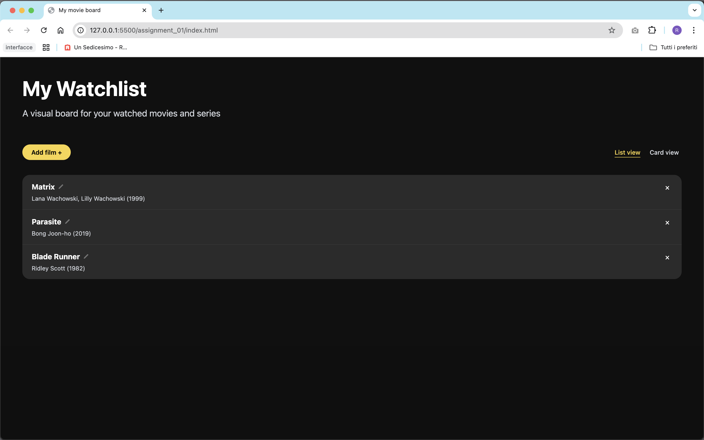

# Assignment 01

## Brief

Starting from the concept of a pinboard, implement a web page that:

- is responsive (properly layout for smartphone, tablet, and desktop)
- allows the user to add and remove elements
- allows the user to customize elements (i.e. colors, size)
- allows the switch between two views (at least)

## Screenshots

## Short project description 

This project is a responsive web pinboard for movies and series. Users can create new pins through a modal window, upload an image, add a title and description, and personalize colors. Pins can be viewed in card or list mode, removed anytime, and the layout adapts to desktop, tablet and mobile.

## Function List

| Function name | Arguments | Description | Returns |
|----------------|------------|--------------|----------|
| **openModal()** | none | Opens the modal window for creating or editing a pin by removing the `hidden` class from both `modal` and `overlay` elements. | `void` |
| **closeModal()** | none | Closes the modal and overlay, resetting the `editingPin` state to `null`. | `void` |
| **openColorPicker()** | none | Opens the hidden color picker when the user clicks on the color label or color preview. | `void` |
| **resetModalFields()** | none | Resets all modal fields (title, description, image, and color) and clears the visual preview. | `void` |

### Event Listeners and Interaction Logic

User interactions such as opening and closing the modal, uploading an image, picking a color, adding or editing pins, removing items from the board, and switching between list and card views are handled through **event listeners** directly bound to the corresponding DOM elements. Each listener updates the interface dynamically without reloading the page, ensuring a smooth and responsive user experience.  
This modular approach keeps the codebase readable, maintainable, and easy to extend.
