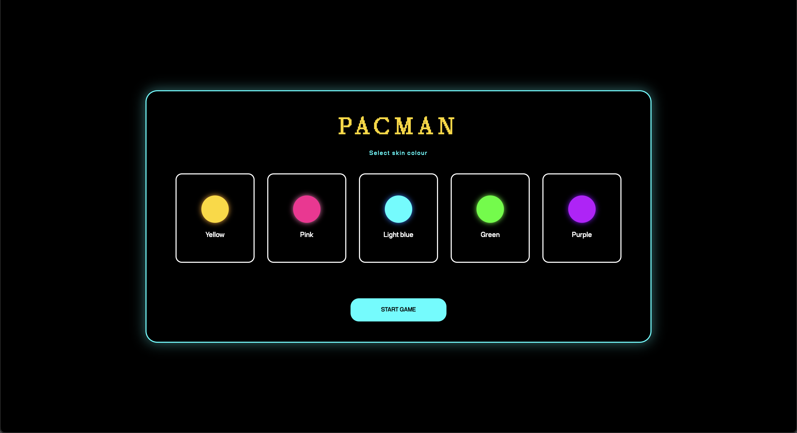
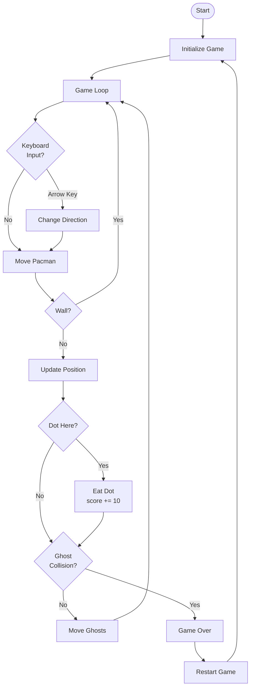

# Pacman

## Brief

Choose a “mini-game” to rebuild with HTML, CSS and JavaScript. The requirements are:

- The webpage should be responsive
- Choose an avatar at the beginning of the game
- Keep track of the score of the player
- Use the keyboard to control the game (indicate what are the controls in the page). You can also use buttons (mouse), but also keyboard.
- Use some multimedia files (audio, video, …)
- Implement an “automatic restart” in the game (that is not done via the refresh of the page)

## Screenshots

## Short project description 

Pacman is a simplified reproduction of the iconic arcade game. The player selects a starting skin, moves through the maze using the arrow keys, collects points, and avoids ghosts. When a collision occurs, a game-over screen appears and an automatic restart is triggered.

## Block diagram

## Function List

### riproduciSuono(audio)
- **Parameters:** audio (HTMLAudioElement)  
- **Logic:** Checks whether the global volumeOn flag is enabled. If the volume is active, it resets the audio playback position to the beginning and attempts to play the sound; otherwise it exits without executing any action.  
- **Returns:** none

### avviaMusicaGioco()
- **Parameters:** none  
- **Logic:** Starts the looping background music used during gameplay, resetting its playback position to the beginning, but only if the global volumeOn flag is enabled.  
- **Returns:** none

### fermaMusicaGioco()
- **Parameters:** none  
- **Logic:** Pauses the background music without resetting its current playback position.  
- **Returns:** none

### fermaTuttiISuoni()
- **Parameters:** none  
- **Logic:** Pauses all main audio tracks (start, playing and game-over sounds), stopping any audio currently playing.  
- **Returns:** none

### createMaze()
- **Parameters:** none  
- **Logic:** Creates a two-dimensional array representing the game grid. It sets the outer borders as walls and adds a predefined set of internal obstacles to form a simple maze.  
- **Returns:** Array<Array<number>> — matrix representing the maze, where 1 indicates a wall and 0 a free cell

### initializeDots()
- **Parameters:** none  
- **Logic:** Iterates through the maze and adds a dot to every free cell inside the borders. It populates the global dots array with the coordinates of each dot.  
- **Returns:** none

### removeDotElement(x, y)
- **Parameters:**  
  - x (number): x-coordinate of the dot  
  - y (number): y-coordinate of the dot  
- **Logic:** Selects the DOM element associated with the dot at the given coordinates and removes it from the board if it exists.  
- **Returns:** none

### showScreen(name)
- **Parameters:**  name (string): name of the screen to show, either menu or playing  
- **Logic:** Toggles the visibility of the menu screen and game screen based on the provided name. It also updates the global gameState and ensures that background music is stopped when the screen is not the gameplay view.  
- **Returns:** none

### clearBoard()
- **Parameters:** none  
- **Logic:** Clears the game board by removing all child elements and resets the references to the Pac-Man and ghost DOM elements.  
- **Returns:** none

### renderBoard()
- **Parameters:** none  
- **Logic:** Rebuilds the entire board: draws maze walls, places dots, creates the DOM elements for each ghost, and creates Pac-Man. It then calls updateDynamicPositions to synchronize visual positions with the current game data.  
- **Returns:** none

### updateDynamicPositions()
- **Parameters:** none  
- **Logic:** Updates the on-screen position of Pac-Man and all ghosts according to their current coordinates. It also applies the correct color, glow and rotation to Pac-Man based on the selected skin and current movement direction.  
- **Returns:** none

### updateHUD()
- **Parameters:** none  
- **Logic:** Updates the score displayed in the HUD by setting the text content of the corresponding DOM element.  
- **Returns:** none

### resetGhosts()
- **Parameters:** none  
- **Logic:** Resets the four ghosts to their initial positions and assigns the correct sprite image to each of them.  
- **Returns:** none

### checkCollision()
- **Parameters:** none  
- **Logic:** Checks whether Pac-Man occupies the same grid cell as at least one ghost.  
- **Returns:** boolean — true if a collision is detected, otherwise false

### fermaTimerAutoRestart()
- **Parameters:** none  
- **Logic:** Stops the automatic restart countdown by clearing the timer interval if active and resetting its reference to null.  
- **Returns:** none

### avviaTimerAutoRestart()
- **Parameters:** none  
- **Logic:** Resets the countdown value to the constant RESTART_SECONDS, updates the timer shown on screen and starts an interval that decreases the counter every second. When it reaches zero, it stops the timer and starts a new match.  
- **Returns:** none

### gestisciCollisione()
- **Parameters:** none  
- **Logic:** Handles the entire game-over sequence after a collision. It stops Pac-Man and the ghosts, interrupts the background music, plays the game-over sound, updates the final score, displays the game-over panel and starts the auto-restart timer.  
- **Returns:** none

### moveGhosts()
- **Parameters:** none  
- **Logic:** For each ghost, calculates all valid directions that do not lead into a wall. It selects one direction at random, updates the ghost’s coordinates, then updates the visual positions and checks whether a collision occurred.  
- **Returns:** none

### startGhosts()
- **Parameters:** none  
- **Logic:** Starts the automatic movement of the ghosts by setting an interval that calls moveGhosts at regular intervals.  
- **Returns:** none

### stopGhosts()
- **Parameters:** none  
- **Logic:** Stops the automatic ghost movement by clearing the movement interval.  
- **Returns:** none

### tryMovePacman()
- **Parameters:** none  
- **Logic:** Calculates Pac-Man’s next cell based on the current direction. If the next cell is not a wall, it updates Pac-Man’s coordinates. Then it checks whether a dot is present on the new cell, removes it, increases the score and updates the HUD. If all dots have been eaten, it resets the dots and board. Finally, it updates the visual positions and checks for collisions.  
- **Returns:** none

### startPacmanAutoMove()
- **Parameters:** none  
- **Logic:** Starts the automatic movement loop for Pac-Man if it is not already active. The interval repeatedly calls tryMovePacman as long as the game is in the playing state.  
- **Returns:** none

### handleKeyDown(e)
- **Parameters:**  
  - e (KeyboardEvent): keyboard event triggered when a key is pressed  
- **Logic:** Detects arrow key presses while the game is running. Updates Pac-Man’s direction accordingly and triggers immediate movement if the automatic motion was not already active.  
- **Returns:** none

### startGame(avatarIndex)
- **Parameters:**  
  - avatarIndex (number): index of the selected skin  
- **Logic:** Initializes a new match: resets Pac-Man’s state, score, maze, dots and ghosts; updates the HUD; sets the board size; renders the board; switches to the game view; starts the ghost movement and plays the start sound.  
- **Returns:** none

## Content and data sources (link)

- **Fonts**
The bitmap fonts used in this project come from [Pangram Pangram](https://pangrampangram.com/products/bitmap-fonts) (trial version).  

- **Audio**
All sound effects used in the game were downloaded from [Pixabay](https://pixabay.com/it/sound-effects/) (free license).

