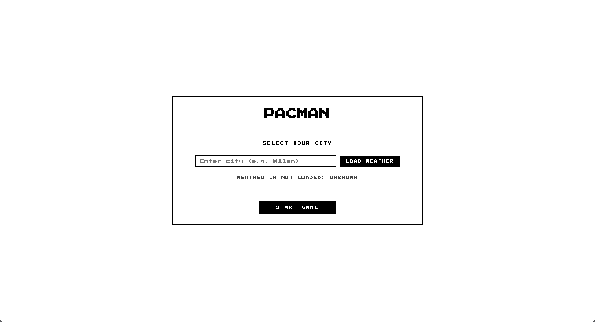
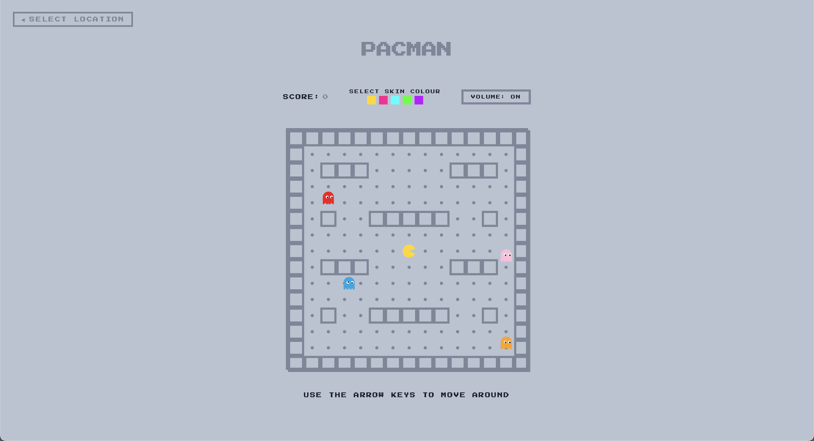
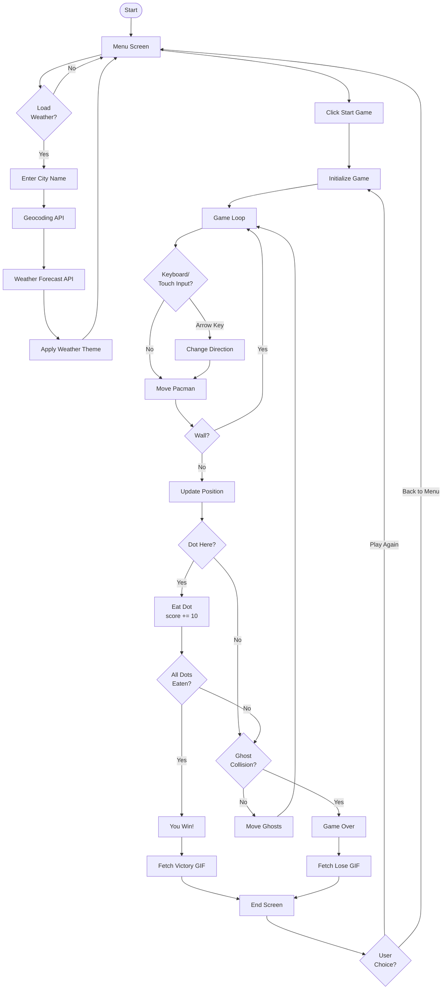

# Pacman

## Brief

Upgrade the **Assignment 02** by adding the use of data coming from an external web API. For example, fetch contents (audio, images, video, text, metadata) from online archives, AI generated contents (chatGPT API), data (weather, realtime traffic data, environmental data).

Have a look at the lesson about the API:

[https://wind-submarine-3d4.notion.site/Lesson-5-200d516637bc811aba69e13b0ffe438f?pvs=74](https://www.notion.so/Lesson-5-200d516637bc811aba69e13b0ffe438f?pvs=21)

The application **must** have those requirements:

- The webpage is responsive
- Use a web API (you choose which one best fists for your project) to load the data and display them in the webpage
- At least one multimedia file (for user feedback interactions, or content itself)
- Develop a navigation system that allows the user to navigate different sections with related content and functionalities

## Screenshots

## Short project description 

This project revisits Pacman with dynamic data-driven features. Players explore the maze, score points, and dodge ghosts, while the interface adapts to live weather conditions retrieved from an API. A reaction GIF system provides playful feedback on game outcomes.

## Block diagram

## Function List

### riproduciSuono(audio)
- **Parameters:** audio (HTMLAudioElement)  
- **Logic:** Checks whether the global volumeOn flag is enabled. If the volume is active, it resets the audio playback position to the beginning and attempts to play the sound; otherwise it exits without executing any action.  
- **Returns:** none

### avviaMusicaGioco()
- **Parameters:** none  
- **Logic:** Starts the looping background music used during gameplay, resetting its playback position to the beginning, but only if the global volumeOn flag is enabled.  
- **Returns:** none

### fermaMusicaGioco()
- **Parameters:** none  
- **Logic:** Pauses the background music without resetting its current playback position.  
- **Returns:** none

### fermaTuttiISuoni()
- **Parameters:** none  
- **Logic:** Pauses all main audio tracks (start, playing and game-over sounds), stopping any audio currently playing.  
- **Returns:** none

### createMaze()
- **Parameters:** none  
- **Logic:** Creates a two-dimensional array representing the game grid. It sets the outer borders as walls and adds a predefined set of internal obstacles to form a simple maze.  
- **Returns:** Array<Array<number>> — matrix representing the maze, where 1 indicates a wall and 0 a free cell

### initializeDots()
- **Parameters:** none  
- **Logic:** Iterates through the maze and adds a dot to every free cell inside the borders. It populates the global dots array with the coordinates of each dot.  
- **Returns:** none

### removeDotElement(x, y)
- **Parameters:**  
  - x (number): x-coordinate of the dot  
  - y (number): y-coordinate of the dot  
- **Logic:** Selects the DOM element associated with the dot at the given coordinates and removes it from the board if it exists.  
- **Returns:** none

### showScreen(name)
- **Parameters:** name (string): name of the screen to show, either menu or playing  
- **Logic:** Toggles the visibility of the menu screen and game screen based on the provided name. It also updates the global gameState and ensures that background music is stopped when the screen is not the gameplay view.  
- **Returns:** none

### clearBoard()
- **Parameters:** none  
- **Logic:** Clears the game board by removing all child elements and resets the references to the Pac-Man and ghost DOM elements.  
- **Returns:** none

### renderBoard()
- **Parameters:** none  
- **Logic:** Rebuilds the entire board: draws maze walls, places dots, creates the DOM elements for each ghost, and creates Pac-Man. It then calls updateDynamicPositions to synchronize visual positions with the current game data.  
- **Returns:** none

### updateDynamicPositions()
- **Parameters:** none  
- **Logic:** Updates the on-screen position of Pac-Man and all ghosts according to their current coordinates. It also applies the correct color and rotation to Pac-Man based on the selected skin and current movement direction.  
- **Returns:** none

### updateHUD()
- **Parameters:** none  
- **Logic:** Updates the score displayed in the HUD by setting the text content of the corresponding DOM element.  
- **Returns:** none

### resetGhosts()
- **Parameters:** none  
- **Logic:** Resets the four ghosts to their initial positions and assigns the correct sprite image to each of them.  
- **Returns:** none

### checkCollision()
- **Parameters:** none  
- **Logic:** Checks whether Pac-Man occupies the same grid cell as at least one ghost.  
- **Returns:** boolean — true if a collision is detected, otherwise false

### fermaTimerAutoRestart()
- **Parameters:** none  
- **Logic:** Stops the automatic restart countdown by clearing the timer interval if active and resetting its reference to null.  
- **Returns:** none

### avviaTimerAutoRestart()
- **Parameters:** none  
- **Logic:** Resets the countdown value to the constant RESTART_SECONDS, updates the timer shown on screen and starts an interval that decreases the counter every second. When it reaches zero, it stops the timer and starts a new match.  
- **Returns:** none

### setReactionImage(url, altText)
- **Parameters:**  
  - url (string): URL of the GIF image to display  
  - altText (string): alternative text for the image  
- **Logic:** Updates the reaction image element with the provided URL and alt text. If no URL is provided, it clears the image and displays a fallback message.  
- **Returns:** none

### fetchGifUrl(tag)
- **Parameters:** tag (string): search query for Giphy API  
- **Logic:** Sends a request to the Giphy API using the provided tag and returns a random GIF URL from the results. Returns null if the API key is missing or if no results are found.  
- **Returns:** Promise<string|null> — URL of the selected GIF or null

### showLoseGif()
- **Parameters:** none  
- **Logic:** Fetches a lose-themed GIF from Giphy API, ensuring it's different from the last one shown. If fetching fails, displays a fallback ghost image. Updates the reaction image element with the result.  
- **Returns:** Promise<void>

### showWinGif()
- **Parameters:** none  
- **Logic:** Fetches a victory-themed GIF from Giphy API, ensuring it's different from the last one shown. If fetching fails, displays a fallback ghost image. Updates the reaction image element with the result.  
- **Returns:** Promise<void>

### getWeatherCodeForCoords(lat, lon)
- **Parameters:**  
  - lat (number): latitude coordinate  
  - lon (number): longitude coordinate  
- **Logic:** Sends a request to the Open-Meteo forecast API using the provided coordinates and extracts the current weather code from the response.  
- **Returns:** Promise<number|null> — weather code or null if unavailable

### getWeatherCodeForCity(cityName)
- **Parameters:** cityName (string): name of the city  
- **Logic:** First uses the Open-Meteo geocoding API to convert the city name into coordinates, then fetches the weather code for those coordinates. Returns both the weather code and a formatted location label.  
- **Returns:** Promise<{weathercode: number|null, label: string|null}> — object containing weather code and city label

### applicaTemaMeteo(weathercode)
- **Parameters:** weathercode (number|null): weather code from Open-Meteo API  
- **Logic:** Removes all existing weather theme classes from the body element and applies a new theme class based on the weather code value. Maps specific weather codes to visual themes like sunny, cloudy, rainy, foggy or snowy.  
- **Returns:** none

### descrizioneMeteoDaCodice(code)
- **Parameters:** code (number|null): weather code from Open-Meteo API  
- **Logic:** Converts a numeric weather code into a human-readable weather description in English.  
- **Returns:** string — weather description like "Clear sky", "Rain", "Snow", etc.

### aggiornaWeatherStatus(label, code, isFallback)
- **Parameters:**  
  - label (string|null): city name or location label  
  - code (number|null): weather code  
  - isFallback (boolean): indicates if using default location  
- **Logic:** Updates the weather status text displayed in the menu screen, showing the city name and current weather description. Handles different display formats for default location, city not found, and normal weather data.  
- **Returns:** none

### caricaMeteoDefault()
- **Parameters:** none  
- **Logic:** Loads weather data for the default coordinates (DEFAULT_LAT, DEFAULT_LON), applies the corresponding theme and updates the weather status display. Used as fallback when no city is provided or when city lookup fails.  
- **Returns:** Promise<void>

### caricaMeteoDaCityInput()
- **Parameters:** none  
- **Logic:** Reads the city name from the input field, fetches weather data for that city using the Open-Meteo API, applies the weather theme and updates the status display. Falls back to default location if the city is not found or if an error occurs.  
- **Returns:** Promise<void>

### gestisciCollisione()
- **Parameters:** none  
- **Logic:** Handles the entire game-over sequence after a collision. It stops Pac-Man and the ghosts, interrupts the background music, plays the game-over sound, fetches a lose GIF from Giphy, updates the final score, displays the game-over panel and starts the auto-restart timer.  
- **Returns:** none

### gestisciVittoria()
- **Parameters:** none  
- **Logic:** Handles the victory sequence when all dots are collected. Stops Pac-Man and ghosts, stops background music, fetches a victory GIF from Giphy, displays the win panel with final score and starts the auto-restart timer.  
- **Returns:** none

### moveGhosts()
- **Parameters:** none  
- **Logic:** For each ghost, calculates all valid directions that do not lead into a wall. It selects one direction at random, updates the ghost's coordinates, then updates the visual positions and checks whether a collision occurred.  
- **Returns:** none

### startGhosts()
- **Parameters:** none  
- **Logic:** Starts the automatic movement of the ghosts by setting an interval that calls moveGhosts at regular intervals.  
- **Returns:** none

### stopGhosts()
- **Parameters:** none  
- **Logic:** Stops the automatic ghost movement by clearing the movement interval.  
- **Returns:** none

### tryMovePacman()
- **Parameters:** none  
- **Logic:** Calculates Pac-Man's next cell based on the current direction. If the next cell is not a wall, it updates Pac-Man's coordinates. Then it checks whether a dot is present on the new cell, removes it, increases the score and updates the HUD. If all dots have been eaten, it triggers the victory sequence. Finally, it updates the visual positions and checks for collisions.  
- **Returns:** none

### startPacmanAutoMove()
- **Parameters:** none  
- **Logic:** Starts the automatic movement loop for Pac-Man if it is not already active. The interval repeatedly calls tryMovePacman as long as the game is in the playing state.  
- **Returns:** none

### changeDirection(newDir)
- **Parameters:** newDir (string): new direction ("up", "down", "left", "right")  
- **Logic:** Updates Pac-Man's direction to the specified value. If automatic movement is not yet active, starts it and triggers an immediate movement attempt.  
- **Returns:** none

### handleKeyDown(e)
- **Parameters:** e (KeyboardEvent): keyboard event triggered when a key is pressed  
- **Logic:** Detects arrow key presses while the game is running and calls changeDirection with the appropriate direction value.  
- **Returns:** none

### startGame(avatarIndex)
- **Parameters:** avatarIndex (number): index of the selected skin  
- **Logic:** Initializes a new match: hides the game-over screen, stops any active timers, resets Pac-Man's state, score, maze, dots and ghosts; updates the HUD; sets the board size; renders the board; switches to the game view; starts the ghost movement and plays the start sound.  
- **Returns:** none

### tornaAlMenu()
- **Parameters:** none  
- **Logic:** Stops all game activity (ghosts, Pac-Man movement, timers, music), hides the game-over screen and returns to the main menu screen.  
- **Returns:** none

## Content and data sources (link)

- **Fonts**  
  The bitmap fonts used in this project come from [Pangram Pangram](https://pangrampangram.com/products/bitmap-fonts) (trial version).  

- **Audio**  
  All sound effects used in the game were downloaded from [Pixabay](https://pixabay.com/it/sound-effects/) (free license).

- **Weather data**  
  Weather information (current conditions and codes) is fetched from the [Open-Meteo](https://open-meteo.com/) API, and used to adapt the game theme to the selected city.

- **GIF reactions (optional)**  
  The game can optionally display win/lose reaction GIFs using the [GIPHY](https://developers.giphy.com/) API (requires a personal API key).
